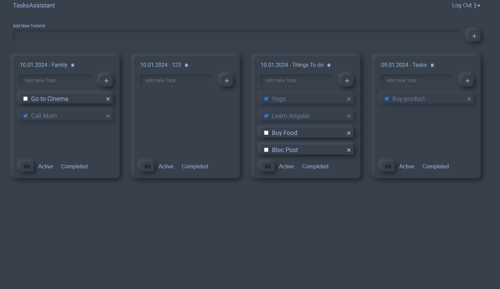

# [**Task Assistant**](https://task-assistant-ver-ii.vercel.app/)

Task Assistance is an intuitive and powerful application designed specifically to make organising and completing tasks
easier. Whether you are a busy professional, a student or just a planning enthusiast, our app will help you manage your
tasks efficiently and achieve your goals.

 

## Key Skills:

- TypeScript:
  Experience in TypeScript development and leveraging its benefits in static typing and error detection.
  Ability to create data types, interfaces, and decorators.
  Understanding of key TypeScript concepts such as types, classes, inheritance, and modules.

- React, Redux Toolkit:
  Deep understanding of React and experience in developing scalable and efficient React applications.
  Knowledge of Redux principles and experience using Redux Toolkit to simplify state management.
  Ability to create high-level components, utilize hooks, and work with React component lifecycle.

- Formik:
  Experience using Formik to create forms and manage their state.
  Understanding of various Formik capabilities, such as validation, value handling, and form submission.
  Ability to customize and configure forms using Formik.

- SCSS:
  Strong understanding of CSS styling and experience working with the SCSS preprocessor.
  Skills in creating reusable styles and components using SCSS.
  Ability to utilize mixins, variables, and nesting to create flexible and modular styles.

- Vite:
  Experience working with the modern build tool Vite for developing fast and efficient web applications.
  Knowledge of Vite configuration and its capabilities for optimizing the development process.
  Ability to manage dependencies and customize the development environment using Vite.

## Technologies

- TypeScript
- React, Redux Toolkit
- Formik
- SCSS
- Vite

## Installation and launch of the project

- Clone the repository to your local computer.
- Install depending on the command npm install.
- Start the project by running npm start.
- Open your web browser and check the address http://localhost:3000.

 
 

## To log in, use the credentials of a shared test account:

##### Email: free@samuraijs.com

##### Password: free

 

## Utilization

### [**Task Assistant**](https://task-assistant-ver-ii.vercel.app/)

## Contribution to the project

We welcome input from the community and would be happy to accept your suggestions for improving the project. If you have
any ideas, bug fixes or new features, please create a pull request or let us know.

## Contacts

If you have any questions or require additional information, please contact us using the following contact information:

Email: [skhurtov.work@yandex.ru](skhurtov.work@yandex.ru)

Thank you for your interest in our project!
